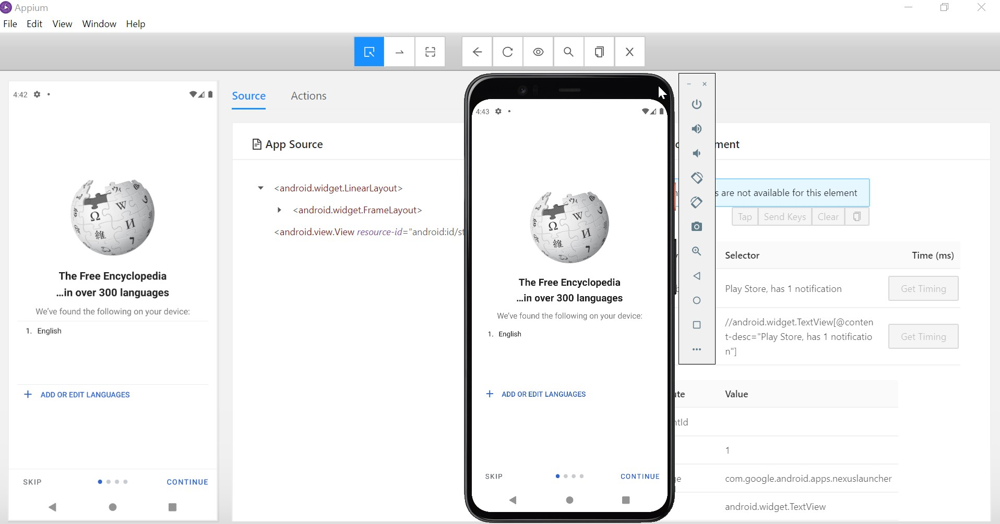
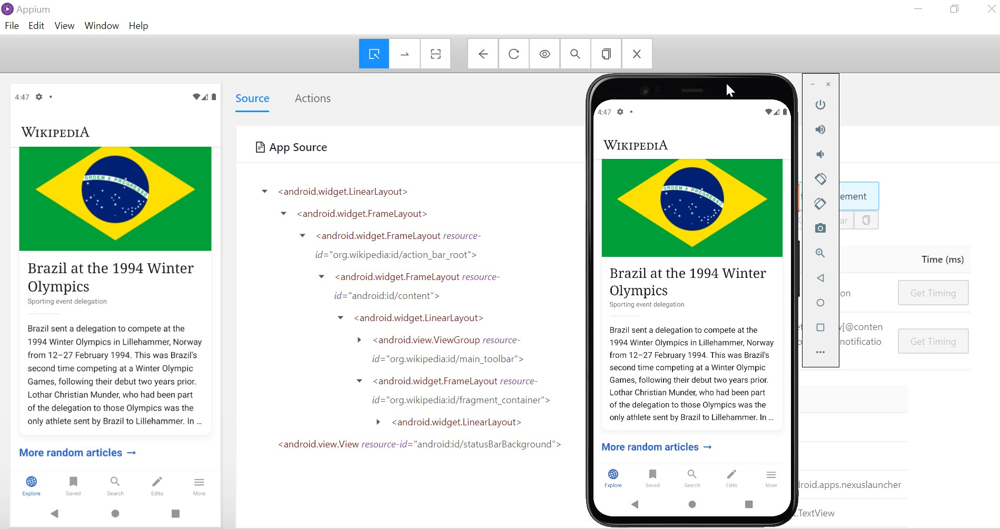
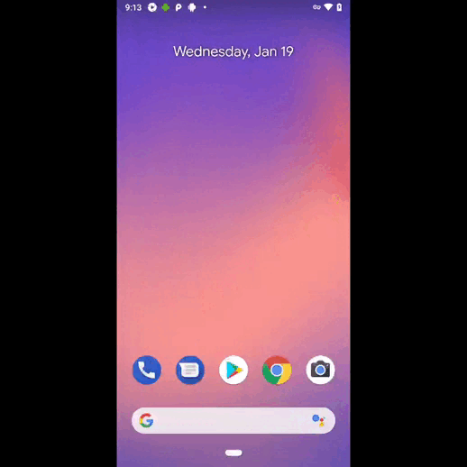

   # Автотесты для мобильного приложения Wikipedia
   
   ##  Работа с мобильным приложением Wikipedia с помощью эмулятора в Android Studio и инспектора в Appium

   

   

   ##  Видео с прохождением теста на поиск в мобильном приложении Wikipedia

   